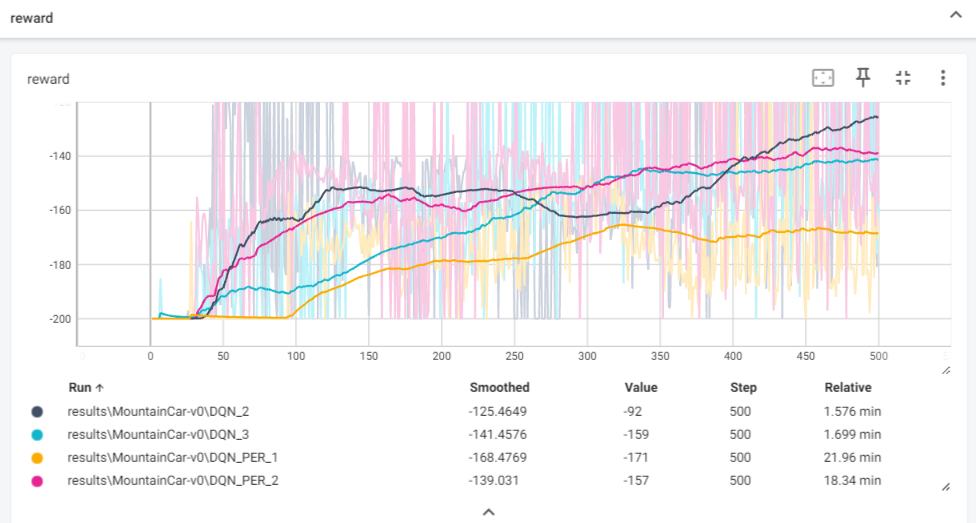
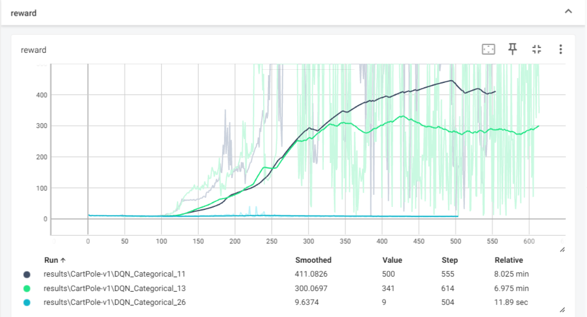
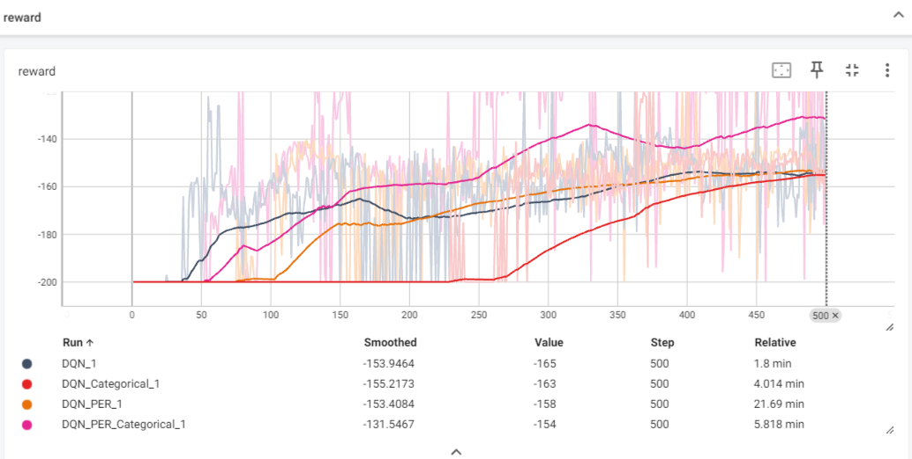

## 1 PER note
在 MountainCar-v0 环境下测试了一下 无PER 和有PER  
DQN_2 ,DQN_3 为seed10 seed100   
DQN_PER_10 ,DQN_PER_100 为seed10 seed100  
效果如图所示：结论：不仅时间耗时长,效果也不如无PER,网上也大都如此。(单加PER的情况)

## 2 C51 note
一开始参考的代码  
https://github.com/deligentfool/dqn_zoo/blob/master/Categorical%20DQN/categorical_dqn.py 有点问题  
在代码的L120处的projection_distribution函数 有两处要修改  
1.127-129行 在对next_dist 进行*support后 在对next_dist应该变为q值,在后续的133行则混淆了两者,此处问题导致模型不能收敛！
应该改为如下:  

    next_dist = target_model.forward(next_observation).detach()#.mul(support)  1.modify
    q = next_dist.mul(support) # 2.modify
    # next_dist: [batch_size, action_dim, atoms_num]
    next_action = q.sum(2).max(1)[1] # 3.modify
    # next_action: [batch_size]
    next_action = next_action.unsqueeze(1).unsqueeze(1).expand(batch_size, 1, atoms_num)
    # next_action: [batch_size, 1, atoms_num]
    next_dist = next_dist.gather(1, next_action).squeeze(1)
    # next_dist: [batch_size, atoms_num]

2.143-144行没有考虑b = 1.时 l=u的情况，会导致模型收敛不稳定  
应该改为如下:  149-150行

    proj_dist.view(-1).index_add_(0, (offset + l).view(-1), (next_dist * (u.float() +(l=u)- b)).view(-1)) # modify
    proj_dist.view(-1).index_add_(0, (offset + u).view(-1), (next_dist * (b - l.float())).view(-1))

效果如下：蓝色为原始参考代码 绿色改1 黑色改1,2

## 3 Noisy note
原始论文 std_init = 0.5  
但是对于有些环境不是很有效 比如 MountainCar-v0 好像设置0.1,0.2左右会比较好 在MountainCar-v0环境中 设置的为0.05，才能收敛。

## 4 Rainbow note
问题1 ：出现了增加了一个算法，时间却反而减少的现象，这里c51算法叠加PER算法后，时间反而比单PER减少了，猜测：可能c51算法拟合的q分布天生和error分布契合，导致优势值的更新时间减少。  

  
结论：
1.在有些环境下单纯累加trick 并不奏效 如MountainCar-v0,需要根据环境特点来选择。  
2.或者说,有些算法的鲁棒性不是很好。  
  
测试发现：
Double,Dueling,具有鲁棒性
N-step Categorical,不具有鲁棒性
Categorical ,PER有良好的叠加性：猜测：原因是两者都适用于奖励稀疏型环境。
待续
