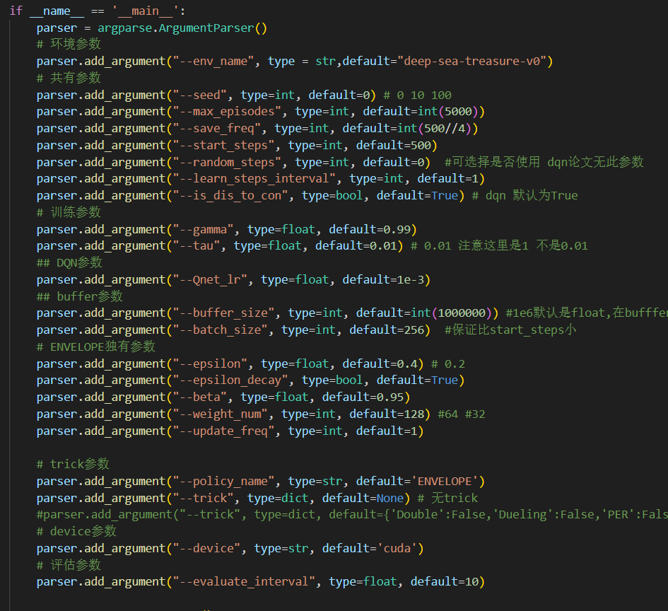

1: 4000
2 ： 1e6
3 : hidden 128 buffer 4000
4： hidden 256 buffer 4000 可以
5 : hidden 256 buffer 10000 不行
6: 4 
7: 4上 beta = 0.85 不行
8: 4上 lr= 5e-4 不行
9：4上 epsilon = 0.3 可以
10 hidden 64 buffer 4000
11 hidden 128 64
12 3上改更新频率为100 和tau=1
13 3上改8000 不行

16 hidden 512 buffer 4000
17 hidden 128 上 64
18 hidden 256 上 64
19 18 上 epsilon 0.4
20 18 上 epsilon 0.5
21 18 上 episode 500
22
23 18上buffer_size 1e6
24 测试loss 同23
25 23 epsilon 0.5
26 23 256-128
27 23 512-256
28 23 beta 0.85
29 23 beta 0.96
30 23 w 128
31 30 上改随机的代码
32 测试代码
35： 31 改128-128
36: 31
37: 512-256
38-51: 36 加上eval
52-53 max_episodes 1000
54  max_episodes 2000

## --
此时最好

hidden_1 = 256 ,hidden_2=256
