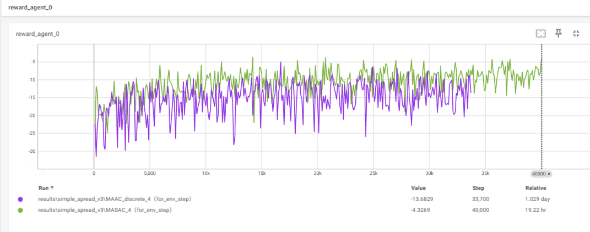

常用代码:
```
MASAC.py (自己写的版本,只有continue版本)
MASAC(env_fix_seed).py（环境固定种子的参数，qq）
MAAC_discrete.py (根据论文复刻的版本,不能将此与MASAC.py比较，即不能将self.attention设为False,因为MASAC无discrete版本)
MAAC_discrete_.py (将上述的随机种子问题的解决方法改成第2种方法(Attention.py中提到) 效果为 \simple_spread_v3\MAAC_discrete__1 前三个为上一个代码的效果)


```
弃用代码:
```
MAAC.py (改写的continue版本,效果不好,暂时弃用)
```

---2025.1.6---
将MASAC.py改成如下，但是速度好像没变，将类似原代码保留在MAAC_discrete.py中。


---2025.3.22---

找到MASAC.py的env.step()时的收敛参数，  
将学习率从1e-3改为1e-4，max_episodes改为40000即可收敛。  
（记录从每回合记录改为每100回合记录）  
效果见：MAAC_file\results\simple_spread_v3\MASAC_4（for_env_step）  

对于MAAC_discrete.py 则是将学习率从1e-3改为5e-4，max_episodes改为40000即可收敛。  

效果见  
