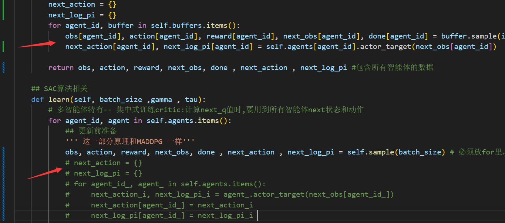

常用代码:
```
MASAC.py (自己写的版本,只有continue版本)
MAAC_discrete.py (根据论文复刻的版本,不能将此与MASAC.py比较，即不能将self.attention设为False,因为MASAC无discrete版本)
MAAC_discrete_.py (将上述的随机种子问题的解决方法改成第2种方法 效果为 \simple_spread_v3\MAAC_discrete_4 前三个为上一个代码的效果)
```
弃用代码:
```
MAAC.py (改写的continue版本,效果不好,暂时弃用)
```

---2025.1.6---
将MASAC.py改成如下，但是速度好像没变，将类似原代码保留在MAAC_discrete.py中。
