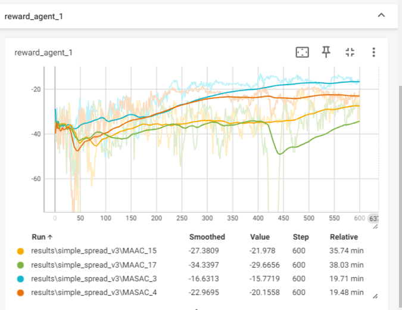
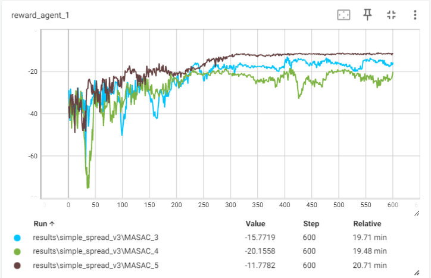

5个智能体的simple_spread_v3环境下  
上两个为MASAC，下两个为MAAC   
感觉MASAC 明显比MAAC 好 且用时短  (此时MAAC的critic由q值更新 actor由adv更新)  
猜测attention机制无用，coma的优势值有用。(不加上优势值更新，效果还要拉跨)  

下图证明了 将环境的action_和训练时输出的action分离,即训练的action和神经网络输出的action一致(此时均为[-1,1]) 会取得比较好的训练效果。  
最上面的棕色线段为分离的。  
