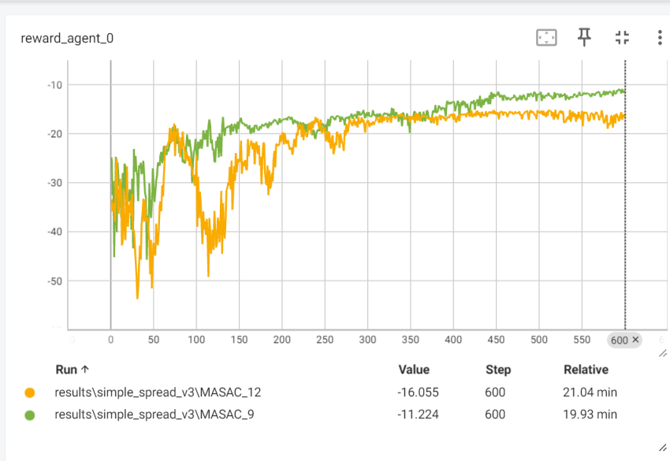
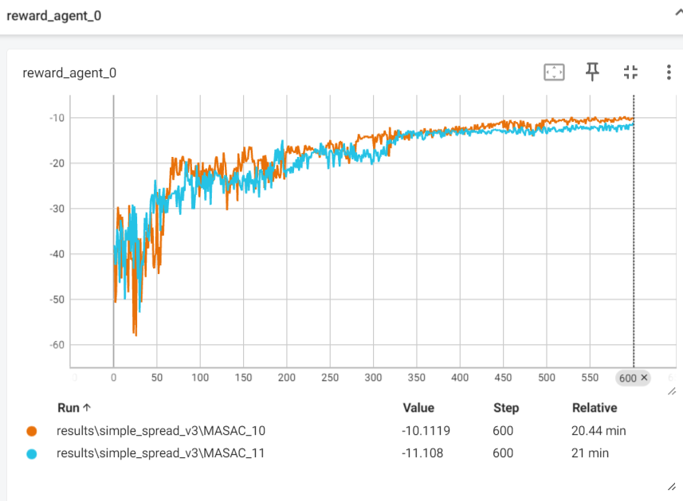

实验分别进行了两个随机种子的实验：分别是seed=0 和10   
方法如下
````
        ##self.log_std_layer = nn.Linear(hidden_2, action_dim) # 此方法可改为MAPPO中只训练一个std的方法  ## log_std 法1
        self.log_std = nn.Parameter(torch.zeros(1, action_dim)) # 与PPO.py的方法一致：对角高斯函数  ## log_std 法2
````

在simple_spread_v3且N=5的环境下，效果大致如下 
seed=10中，_12为法1的结果,_9为法2的结果

seed=0中，_10为法1的结果,_11为法2的结果


结论：法1的效果更好  
（可能效果好的曲线有一条(_12)是多增加了500个random_step的条件，但是此条件为在实验中发现是负面效果条件，结果仍然成立）