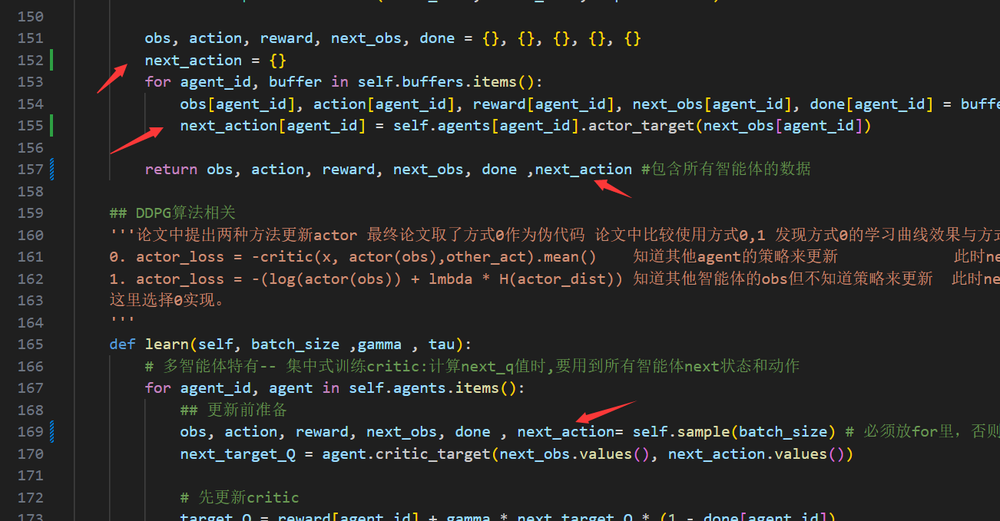
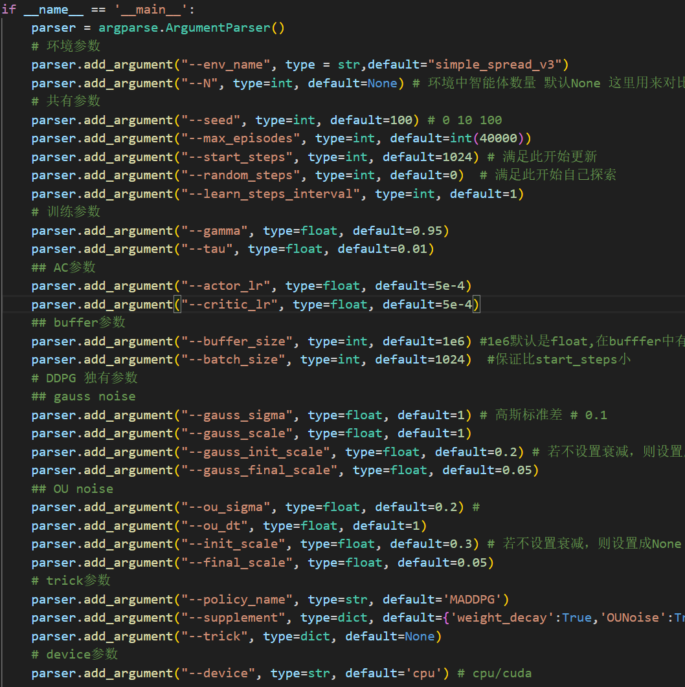
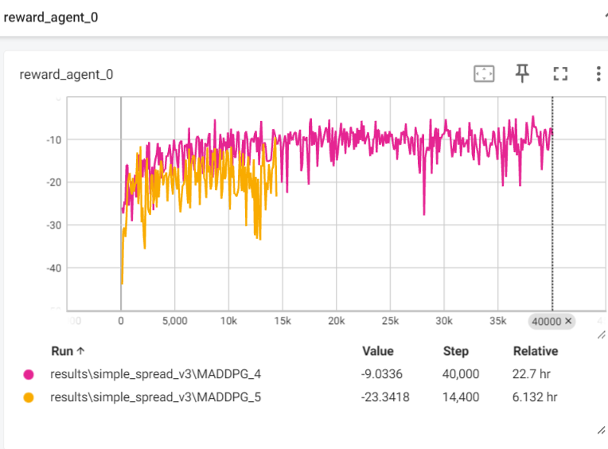

常用代码:
```
MADDPG.py
MADDPG_simple.py
MADDPG_with_tricks.py(加入了ATT机制)
```
复刻代码：
```
MADDPG_reproduction.py
```
---2025.1.4更新(鲁棒性问题)---
将原来的

改为如下，以增加训练时的速度，减少重复步骤。


---2025.3.10更新---  
发现之前的收敛都是基于环境的初始化种子是同一个的情况下。
```
env.reset(seed = args.seed) 
```

在单智能体上这样做，并且之后评估效果都还可以，但是在多智能体上这样做，效果就不好，猜测之前单智能体的环境一开始初始化几乎一致，或者说环境简单只需要初始化一个智能体的位置，而多智能体的环境需要初始化多个智能体的位置，所以这样做会导致多智能体的使用上述情况的训练下的模型去评估（在不同环境随机种子下评估）的效果，几乎只有在训练的环境上能够达到目标奖励，而在其他环境上的效果就不好。


且github上的收敛代码基本上是基于
```
env.reset()  # 每次初始化种子随机
```
这样的情况下，训练出的模型才更具有鲁棒性，缺点是这样会导致每次的训练曲线不一致。

在此情况下，修改参数 效果在 MADDPG_file\results\simple_spread_v3\MADDPG_4 和 _5 (_5仅修改了学习率)

（这里是默认智能体个数为3的情况下，具体可详见：MADDPG_file\image_assist\MADDPG copy.py）  


发现仅仅修改学习率为5e-4 和max_episodes长度为40000  (对MADDPG_simple.py也适用（已实验）,那么推测对MATD3也适用)
在MADDPG.py上也可以收敛，只是效果不太好。  
效果如下：（每100episodes 记录一次奖励） 
红：参数改为如上 黄：仅仅改学习率为5e-4
