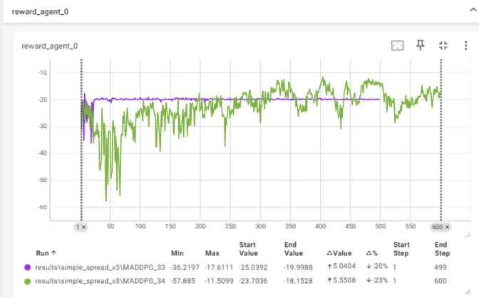
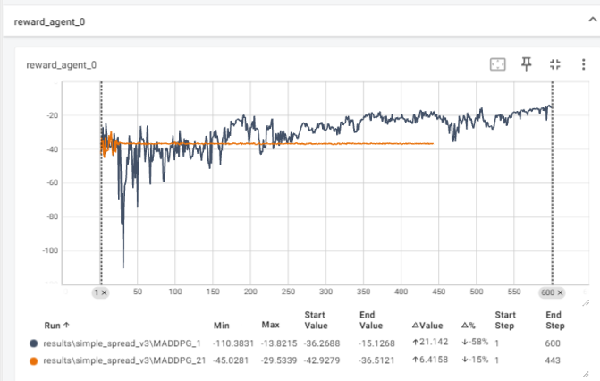
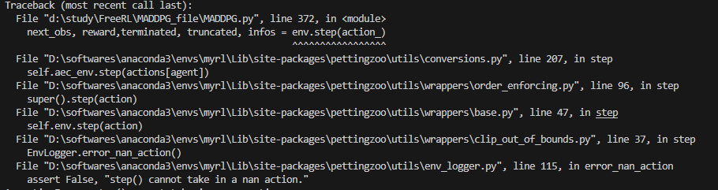
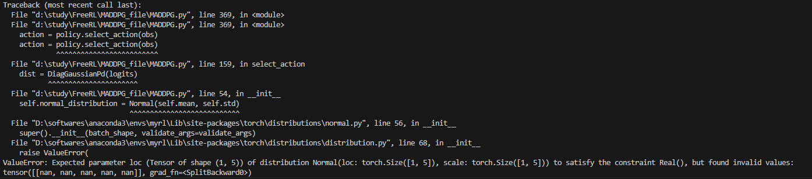
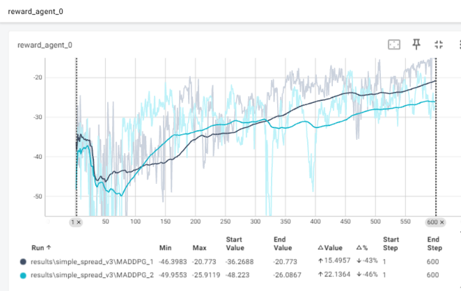

原论文复现的代码为MADDPG_reproduction.py,主要实现论文中说明的两种方式。    
方法0：ensemble  
方法1：aprox    
测试发现：  
1.原论文中的方式0，即伪代码中的方式效果较好（在github上开源的复现复现代码基本是这个方式）    
2.而原论文中的方式1（aprox方式） 原始代码：https://www.dropbox.com/scl/fi/2qb2470nj60qk7wb10y2s/maddpg_ensemble_and_approx_code.zip?rlkey=i91gpxnwatejajrvr9qzlk576&e=1&dl=0   
由于代码是tensorflow写的，可能部分代码了解的不够明白，复现的结果的效果并不好。（达到一个次优解不动了）  
在seed = 1 下的两者对比    
  
在seed = 0 下的两者对比      
  
3.而且有一点不是很明白，论文中说这个主要是ddpg算法，而ddpg是确定性算法，而这个1用的则是action的分布，从分布中取样的话，那应该是随机性策略，和这个确定性背道而驰了呀，且在训练过程中还会出现nan的action的值的现象。  
  
  
4.原代码中加入了对动作的一个小惩罚 (new_action**2).mean() * 1e-3 但是原论文中没有提及，猜测：如果目标action在0附近会有优化。
实验了一次效果如下：  (效果稍差于不加惩罚的效果 seed = 0的情况下)
