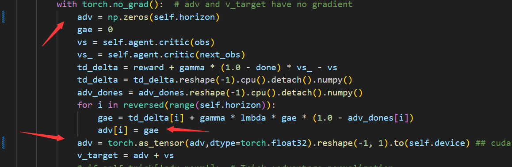

常用代码:
MAPPO:
```
MAPPO.py
MAPPO_attention.py
```
HAPPO:
```
HAPPO.py
```
MAT:
```
MAT.py
MAT_mod_buffer.py(简化buffer相关函数的代码，但是效率一致)
```

---2025.1.4更新---
将 PPO update 的代码

均改成类似如下形式（效果不变），以避免在中间箭头时在MAT中出现的 can't assign a numpy.ndarray to a torch.FloatTensor错误，错误原因：numpy.float64可以赋值给torch.FloatTensor，但是numpy.ndarray不行。
```python

