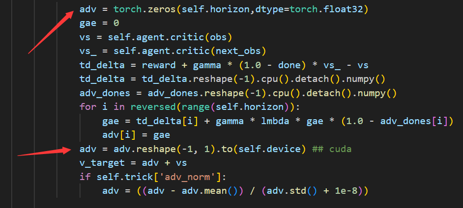
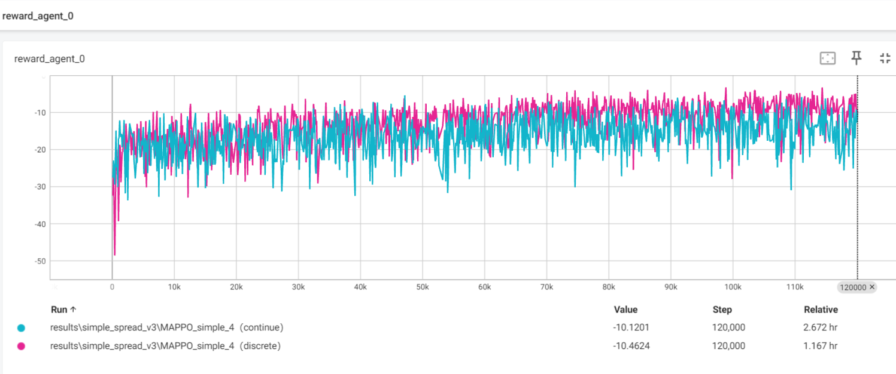
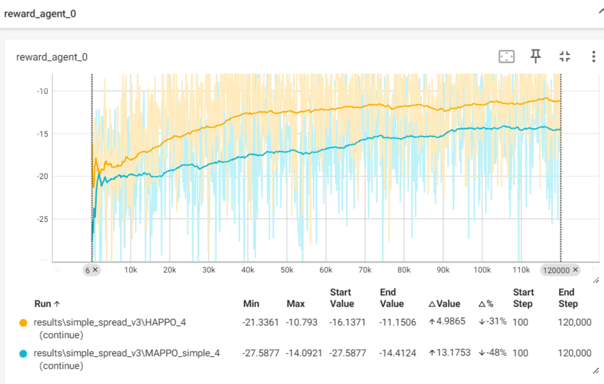
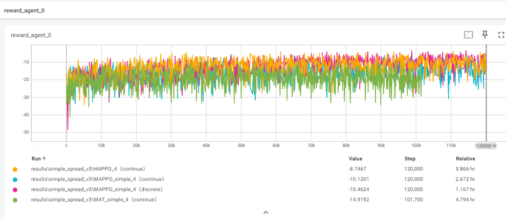

常用代码:
MAPPO:
```
MAPPO.py（只支持continue）
MAPPO_discrete.py
MAPPO_attention.py
```
HAPPO:
```
HAPPO.py（只支持continue）
```
MAT:
```
MAT.py（只支持continue）
MAT_mod_buffer.py(简化buffer相关函数的代码，但是效率一致)
```

已弃用
```
MAPPO(discard).py(更新learn函数逻辑不对，但在env_step(固定种子)效果和MAPPO.py一致,由于之前的实验数据基本都在这个上面运行，所以保留)
HAPPO(discard).py(更新learn函数逻辑不对，但在env_step(固定种子)效果和HAPPO.py一致,由于之前的实验数据基本都在这个上面运行，所以保留)
```

---2025.1.4更新---
将 PPO update 的代码

均改成类似如下形式（效果不变），以避免在中间箭头时在MAT中出现的 can't assign a numpy.ndarray to a torch.FloatTensor错误，错误原因：numpy.float64可以赋值给torch.FloatTensor，但是numpy.ndarray不行。


---2025.3.20更新---

第一部分
增加了MAPPO_discrete的实现。  
关于env.reset(seed = args.seed)的问题，和MADDPG的情况一样。  
补充说明：  
1.MAPPO.py只支持continue环境的情况。  
2.MAPPO_discrete.py只支持离散动作空间的情况。
3.

具体参数只要将学习率1e-3 改为5e-4，max_episodes改为120000即可。(学习率改为1e-3不收敛，以及改为continuous_actions= False也不收敛,所以是只适用于连续动作空间的情况)
（详见：MAPPO_file\image_assist\MAPPO copy.py）

或者见：MAPPO_discrete.py 这里环境为env.reset() 这里学习率为1e-3

两者效果如下：（均能收敛,discrete的学习率较大所以收敛快点）


第二部分
对于HAPPO同样进行逻辑的修改
HAPPO只实现了连续动作的实现，离散动作暂未实现，离散动作实现可参考MAPPO_discrete.py。
学习率则改为1e-4，才能收敛，5e-4不收敛（或收敛不明显）。

效果如下：HAPPO:1e-4 MAPPO_simple:5e-4



更多算法，效果如下：  
MAT：1e-4    


---2025.4.17更新---

终于发现自己实现的MAPPO.py的discrete环境下不能收敛的问题了。    
是环境上的问题，算法上没问题， 将原来策略直接输出的action_,用int()转换成int类型就可以了。原因：PettingZoo的离散动作空间对np.array(0)的支持不友好，不如gymnasium的支持好。
```
action_ = { agent_id: int(action[agent_id]) for agent_id in env_agents} ## 针对PettingZoo离散动作空间 np.array(0) -> int(0)
```
至此，HAPPO,MAT的discrete环境下也可以收敛了。

-----2025.6.7更新---  
增加了对环境SMACv2的支持
代码如下：
```
MAPPO_for_mask_action.py （全局状态仅为各部分状态拼接） 效果见results/smacv2/MAPPO_1
MAPPO_for_mask_action_state.py (全局状态各部分状态拼接+全局环境状态) 效果见results/smacv2/MAPPO_2
```
两个效果多次实验发现差不多，在30kepiosdes下，胜率为12%左右，效果不如https://github.com/Lizhi-sjtu/MARL-code-pytorch/tree/main/2.MAPPO_SMAC 这里实现的效果（去掉RNN效果更好，为18%左右），以后再实验是什么原因导致的。


修改之前的MAPPO_attention.py出现的修改错误 见issue4
