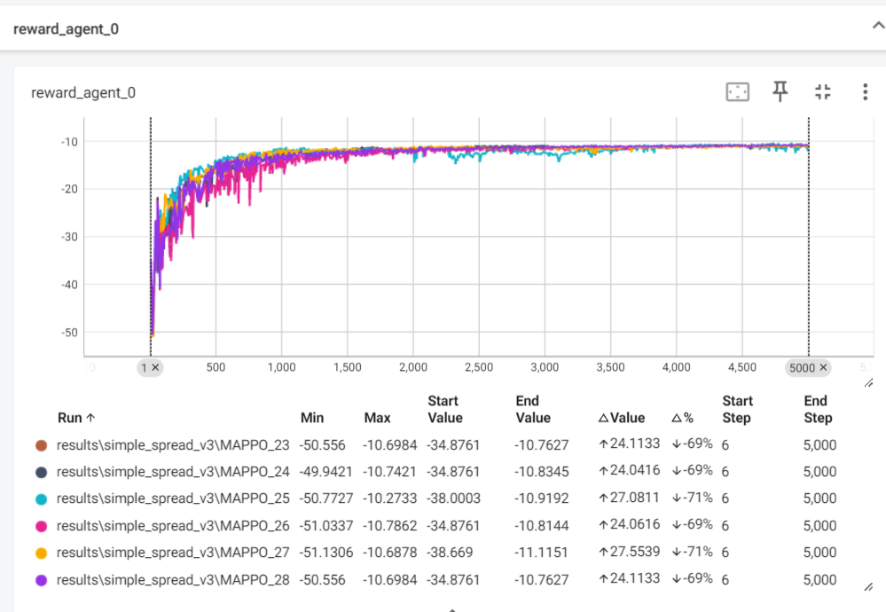

MAPPO中环境simple_spread_v3 seed=0 时的最佳参数探索
```
    horizon  minibatch_size  max_episodes
24: 256 64 5000 
25：128 32 5000 
26: 512 512 5000
27 128 128 5000
28 256 256 5000 最佳 最平稳 
```
其余参数一致  
效果如下： 故选择28的参数
