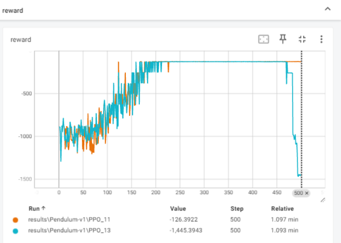
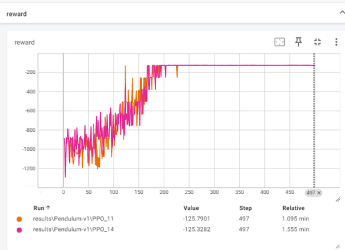
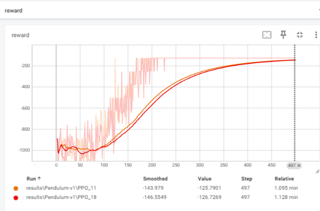
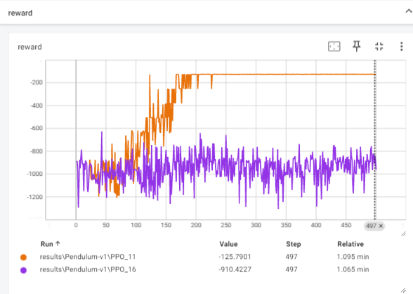
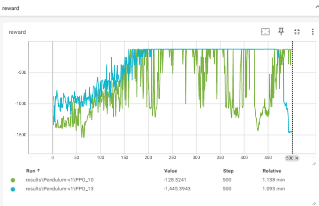
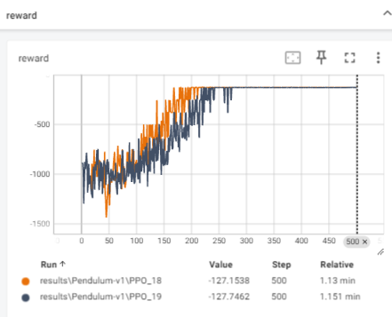

## 记录ppo的算法实现
    PPO论文中提到
    计算V_target 有两种方法1.generalized advantage estimation 2.finite-horizon estimators
    第2种实现方法在许多代码上的实现方法不一,有buffer中存入return和value值的方法,也有在buffer里不存，而在在更新时计算的方法。
    这里我们选择第1种,在buffer中不会存在上述争议。
    通常ppo的buffer中存储的是obs, action, reward, next_obs, done, log_pi ;
### 比较1.不存储log_pi,而是在更新时计算出log_pi_old, 2.存储log_pi，将此作为log_pi_old 发现2更好 采用2
环境为 Pendulum-v1
PPO_11 为方法2 PPO_13 为方法1 两者大体一致,但方法二更稳定点。

### 另外一处 ：在小批量更新网路的实现中：  
1.使用小批量更新较快，   --> for i in range(K) 小批量随机 for j in range(horizon // minibatch): 更新小批量i （直至到整个horizon结束）  
2.使用整块整块更新较慢。 但效果稍好  --> for i in range(K) for j in range(horizon // minibatch): 整块更新

论文采用的是方法1。   
橙色方法1 粉紫色方法2  (实现在PPO_no_minibatch.py)

## 细节GAE的实现
GAE的done为一个时长为T的回合的结束   
而TD_error的done以是否能获得下次奖励为结束。  
红色为不区分GAE的done。
  
## 对于PPO必须收敛的关键为V_target的定义
v_target = adv + v(t) #正确  
v_target = reward + gamma * (1.0 - done) * v(t+1) #错误  一点不收敛  

## 参数敏感
对horizon 即临时buffer容量参数比较敏感
蓝色：horizon=2048 绿色 horizon=256 其余参数一样 minibatch 均为64

### 仿照《动手学强化学习中的代码》实现
PPO_d.py 利用https://hrl.boyuai.com/chapter/2/trpo%E7%AE%97%E6%B3%95 的compute_advantage的代码
和 不存储log_pi,而是在更新时计算出log_pi_old 的方法  
效果如下：(PPO_d.py 为灰色，略逊于PPO.py)
