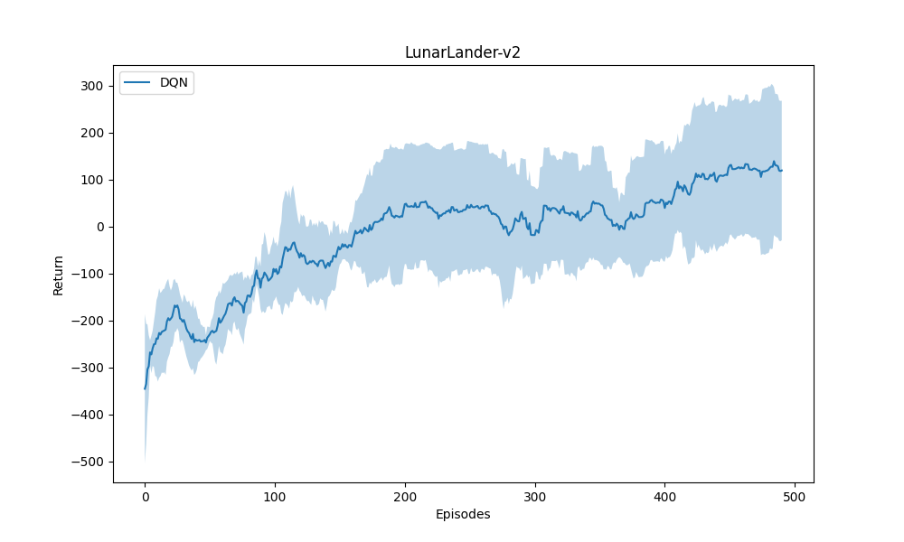
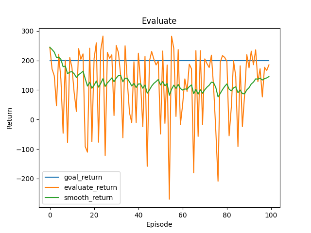
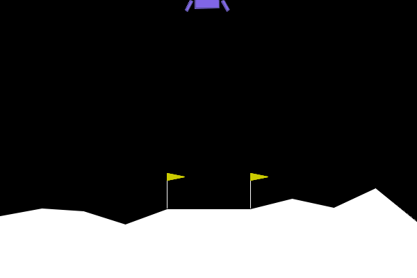
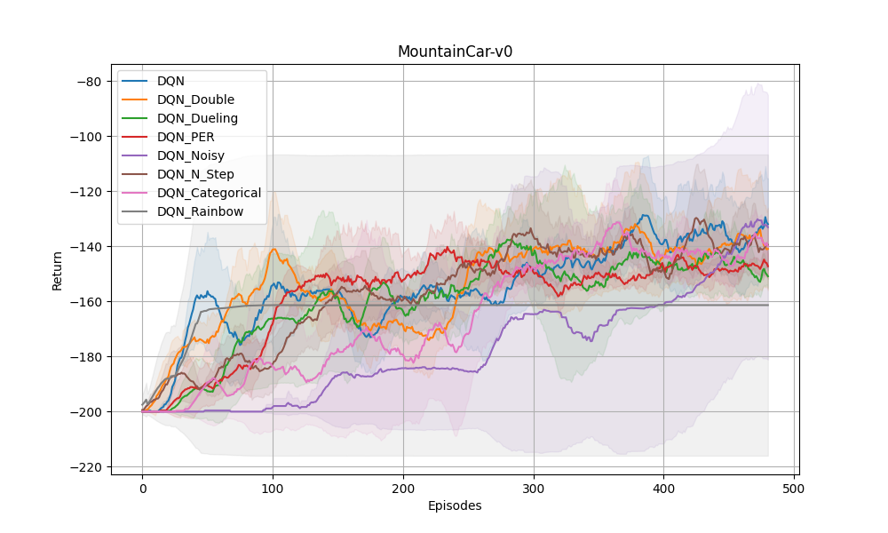

## 参考
* [动手学强化学习](https://hrl.boyuai.com/)
* [elegentRL](https://github.com/AI4Finance-Foundation/ElegantRL)
* [DRL-code-pytorch](https://github.com/Lizhi-sjtu/DRL-code-pytorch)
* [easy-rl](https://github.com/datawhalechina/easy-rl/blob/master/notebooks/DQN.ipynb)
* [maddpg-pettingzoo-pytorch](https://github.com/Git-123-Hub/maddpg-pettingzoo-pytorch)
* [深度强化学习](https://github.com/DeepRLChinese/DeepRL-Chinese/blob/master/04_dqn.py)
* [reinforcement-learning-algorithm](https://github.com/Git-123-Hub/reinforcement-learning-algorithm)
* [DRL-Pytorch](https://github.com/XinJingHao/DRL-Pytorch/)
* [cleanRL](https://github.com/vwxyzjn/cleanrl)
* [MARL-code-pytorch](https://github.com/Lizhi-sjtu/MARL-code-pytorch/tree/main/1.MAPPO_MPE)


目的是写出像TD3作者那样简单易懂的DRL代码,  
由于参考了ElegentRL和Easy的库,from easy to elegent 故起名为freeRL,  
free也是希望写出的代码可以随意的,自由的从此代码移植到自己的代码上。  
库的介绍：[【FreeRL】我的深度学习库构建思想](https://blog.csdn.net/weixin_56760882/article/details/142176797)  
库的不定时更新的博客：[CSDN:荒野火狐](https://blog.csdn.net/weixin_56760882)  
更多项目见：[FreeRL_for_play](https://github.com/wild-firefox/FreeRL_for_play)

## python环境
```python
python 3.11.9
torch 2.3.1+cu121
gymnasium[all] 0.29.1
pygame 0.25.2 # 这个版本和gymnasium[all]0.29.1兼容
pettingzoo 1.24.3
```

基础依赖
```bash
torch >= 2.3.1 
gymnasium >= 1.0.0 # 简单环境
numpy >= 1.26.3
tensorboard>=2.19.0
```


## 效果
用DQN算法在LunarLander-v2环境下训练500个轮次的3个seed的效果：线为均值，阴影为方差

用 seed = 0 训练的模型评估,评估100个不同的seed的结果

随机选择其中一个seed的结果，渲染环境


## 显示训练
训练时，使用tensorboard来显示实时的学习曲率。

```bash
## 先激活环境
tensorboard --logdir=results/env_name
```

在跳出的http://localhost:6008/ 按住ctrl点击进入就行。

tensorboard保存的文件events.out.tfevents.和模型的位置一致。

注：上述生成图的画图函数(in plot_learning_curves.py)已修改，由卷积滑动smooth造成的横坐标显示不全改成了可以显示全的指数平滑。

## 已实现
以下均实现了cuda和cpu切换。
* DQN 1.DQN   
2.DQN_Double  
3.DQN_Dueling  
4.DQN_PER  
5.DQN_Noisy  
6.DQN_N_Step  
7.DQN_Categorical  
8.DQN_Rainbow  

  

* DDPG    
其中包括4细节trick实现：in DDPG ,   discrete的2种实现 in DDPG_simple_add_discrete.py 
注：lose为利用gumbel_softmax来实现DDPG_discrete留存的失败实现。   
1.weight_decay  
2.OUNoise  
3.net_init  
4.Batch_ObsNorm or ObsNorm  
* PPO  
其中包括7个trick实现 in PPO_with_tricks.pt,一个变体 in PPO_std_decay.py   
注：PPO_d,PPO_no_minibath为PPO复刻时的对比实验。  
1.adv_norm  
2.ObsNorm or Batch_ObsNorm   
3.reward_norm or reward_scaling  
4.lr_decay    
5.orthogonal_init  
6.adam_eps  
7.tanh    
* TD3
* SAC
包含discrete的一种实现 in SAC_add_discrete.py
* MADDPG  
注：
1.MADDPG_reproduction.py,主要实现论文中说明的两种方式。      
2.MADDPG_simple.py 为MADDPG论文中伪代码的实现,也为DDPG_simple.py的多智能体版本。  
3.MADDPG.py 为DDPG.py的多智能体版本。    
其中包括1个trick实现 in MADDPG_simple_with_tricks.py  1.ATT  
4.**MATD3_simple.py** 为MATD3的简单实现。  
  
* MAPPO   
注：MAPPO 为复刻原代码实现 其中有12个tricks MAPPO_simple 为无tricks的实现。
1.MAPPO_attention.py 加入了attention机制  
2.**HAPPO.py** 为MAPPO基础之上的改进  
3.**MAT.py** 以HAPPO为基础，引入了transformer    
4.**IPPO.py** 以PPO为基础，拓展到多智能体的实现，适用于博弈环境（自己写的实现）

* MAAC  
1.**MASAC.py** (自己写的版本,只有continue版本)  
2.MAAC_discrete.py (根据论文复刻的版本)  

* MORL    
1.ENVELOPE_DQN.py  
2.ENVELOPE_DDPG.py    

* REINFORCE  
1.REINFORCE.py    

CEM_RL：
* CEM_GD3PG(已成功复现,未加评估)

## 引用说明
如果您在研究或项目中使用了FreeRL，请按以下格式引用：  
学术引用（BibTeX格式）：
```bibtex
@misc{FreeRL2025,
  author = {Gu Jiacheng},
  title = {FreeRL: A Free and Flexible Reinforcement Learning Library}, 
  year = {2025},
  publisher = {GitHub},
  journal = {GitHub repository},
  howpublished = {\url{https://github.com/wild-firefox/FreeRL}},
  note = {Open-source library for RL algorithms and tools.} 
}
```
项目文档中的引用
在项目文档或README中，请包含以下内容：
```markdown
本项目使用了FreeRL (https://github.com/wild-firefox/FreeRL) 库。
```
代码中的引用
在使用FreeRL的代码中，建议添加如下注释：
```python
# This code utilizes FreeRL framework
# https://github.com/wild-firefox/FreeRL
```

--- 2025.3.22 更新 ---  
MARL的学习率总结：AC学习率一致（针对env.step(),智能体个数为3的情况下,其他未提到的学习率均不收敛/收敛不明显）  
**注：具体详见各个MARL的库的readme.md,简单固定种子环境下，1e-3均能收敛（MAT是5e-4除外）**   
MADDPG / MATD3: 5e-4   
MAPPO：5e-4  
MAPPO_discrete：1e-3/5e-4  
HAPPO:1e-4  
MASAC:1e-4  
MAAC_discrete:5e-4  
MAT：1e-4  

--- 2025.4.17 更新 --- 
解决了MAPPO,HAPPO,MAT的discrete不收敛情况，加入了IPPO的实现。
